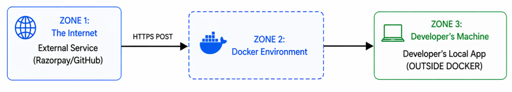

<div align="center">
  
  <h1>HookRelay</h1>
  <p>Catch webhooks. Inspect them. Forward to your local app. Replay on demand.<br><strong>Webhook data is stored locally. In Cloudflare tunnel mode, payloads transit Cloudflare before reaching your machine.</strong></p>

  [](LICENSE)
  [](docker-compose.yml)
  [](backend/requirements.txt)
  [](docker-compose.yml)
</div>

HookRelay is a self-hosted webhook proxy. It catches webhooks from services like Stripe or GitHub, shows them in a real-time dashboard on `localhost`, and forwards them to your local dev server. 

I built this because alternatives like Webhook.site or RequestBin store your payloads on their servers. That's a dealbreaker when you're working with real payment data, health records, or strict client NDAs. HookRelay stores webhook data locally in Docker. If you use the bundled Cloudflare tunnel, the payload still transits Cloudflare on the way to your machine, but the dashboard and control plane stay local-only.

---

## Why I built this

If you've ever built a payment integration, you know the workflow:
1. Razorpay or Stripe needs a public HTTPS URL to send webhooks to.
2. Your app is running locally on `localhost:3000` and can't receive them.
3. You run ngrok, which means sensitive payment payloads are now passing through a third-party server.
4. If you're using a free tunnel, your URL changes every time you restart it. You spend half your day updating the webhook endpoint in the Stripe dashboard.

HookRelay fixes this. It gives you a stable public URL, catches the events, and proxies them to your local app.

```text
Razorpay → https://hooks.yourdomain.com/api/hooks/razorpay
                        ↓  
                   HookRelay Dashboard (localhost)
                        ↓  
           http://localhost:3000/api/webhooks/razorpay
                        ↓  
                   200 OK  or  500 Error
```

---

## Features

- **Automatic public URLs:** It spins up a Cloudflare quick tunnel automatically on boot. No account required.
- **Permanent URLs:** If you have a Cloudflare account and a cheap domain, you can set a permanent webhook URL that survives restarts.
- **GitHub quick-tunnel auto-repair:** If you stay on the free quick tunnel, HookRelay can automatically repair one GitHub repository webhook URL whenever the tunnel changes.
- **Local-only dashboard:** The dashboard, replay tools, session config, and event history stay on `localhost`.
- **Instant dashboard:** A React frontend connected via WebSockets shows webhooks the second they arrive.
- **Auto-forwarding:** Tell it where your local app is running (e.g., `host.docker.internal:3000`), and it forwards payloads automatically.
- **Replay events:** Resend any webhook with one click. Good for debugging your handlers without triggering new test payments.
- **Download JSON:** Export payloads to build mock data for unit tests.

---

## Architecture

Here's how a webhook travels from the internet to your local code:



**The flow:**
1. An external service hits your public tunnel URL with a POST request.
2. The `cloudflared` container sends that request to a dedicated public ingress proxy.
3. The public ingress proxy allows only `POST /api/hooks/{session}` and forwards it to FastAPI.
4. FastAPI saves the event to PostgreSQL and publishes it to Redis.
5. Your local-only dashboard on `localhost` reads the event history and receives live updates over WebSocket.
6. FastAPI forwards the original payload to your local app via `host.docker.internal`.
7. Your app's response (like a 200 OK) is recorded back in the database.

And here is how the seven Docker containers communicate internally:


### Tech stack

- **Backend:** FastAPI + SQLAlchemy
- **Database:** PostgreSQL 15
- **Message Broker:** Redis 7 
- **Frontend:** React + Vite
- **Proxy:** Nginx
- **Tunnel:** Cloudflare `cloudflared`

---

## Getting started

You need [Docker Desktop](https://www.docker.com/products/docker-desktop/) and Git installed. Docker handles all the actual dependencies (you don't need Python or Node installed locally).

1. Clone the repo and boot the containers:
```bash
git clone https://github.com/vishalp-dev24/hookrelay.git
cd hookrelay
docker compose up --build
```

2. Wait for the containers to start. The terminal will print out a temporary Cloudflare URL.
3. Open `http://localhost` in your browser to view the dashboard. The dashboard and control APIs are intentionally local-only.

### How to use it

1. **Create an endpoint:** Click `New Endpoint`, name it something like `stripe` or `github`, and optionally keep the generated ID.
2. **Copy your public URL:** Use the `Public URL` block at the top of the dashboard. This is the URL you give the third-party sender.
3. **Set your forward destination:** Use `Forward Target` to point at your local app, for example `http://host.docker.internal:3000/api/webhooks`. We use `host.docker.internal` instead of `localhost` so the container can reach your host machine.
4. **Test it:** Trigger a test event or fire a real webhook from the provider. It will show up in the dashboard and hit your local app.

### Real GitHub test flow

Do **not** use GitHub OAuth login as a HookRelay test. OAuth redirects are unrelated to webhook delivery.

Use a real repository webhook instead:

1. Run HookRelay.
2. Run your local receiver app on port `3000`.
3. In HookRelay, create the endpoint `github`.
4. Set the forward target to `http://host.docker.internal:3000/api/webhooks/github`.
5. In GitHub repository settings, add a webhook with:
   - Payload URL: `https://<your-hookrelay-public-url>/api/hooks/github`
   - Content type: `application/json`
   - Secret: the same secret your local app uses to verify GitHub signatures
   - Events: start with `ping` and `push`
6. Use GitHub's test delivery or push a commit.
7. Verify the event appears in HookRelay and the forwarded request returns `200`.

---

## Setting up a permanent URL

The default "quick tunnel" gives you a random URL like `https://random-words.trycloudflare.com` that changes every time Docker restarts. If you want a URL that stays the same permanently, you can use a Cloudflare named tunnel. It's free, but you need a domain name.

1. Set up a free Cloudflare account and add a domain name to it.
2. Go to the Zero Trust Dashboard → Networks → Tunnels → Create a tunnel. Name it `hookrelay` and copy the tunnel token.
3. Add a public hostname to the tunnel (e.g. `hooks.yourdomain.com`). Point the service to `http://public_ingress:80`.
4. Copy `.env.example` to `.env` in the project root.
5. Add your token and hostname to the `.env` file:
```env
CLOUDFLARE_TUNNEL_TOKEN=your_token_here
TUNNEL_HOSTNAME=hooks.yourdomain.com
```
6. Restart Docker (`docker compose down` then `docker compose up -d`).

The script inside the tunnel container checks for that `.env` file. If it finds the token, it boots the permanent tunnel. If not, it falls back to the random quick tunnel.

### Quick-tunnel GitHub auto-repair

If you do **not** want to buy a domain and you are using GitHub repository webhooks, HookRelay can repair the GitHub webhook URL automatically after a restart.

Add these values to `.env`:

```env
GITHUB_WEBHOOK_TOKEN=your_fine_grained_token
GITHUB_WEBHOOK_OWNER=your_github_owner
GITHUB_WEBHOOK_REPO=your_repository_name
GITHUB_WEBHOOK_SECRET=the_same_secret_used_by_your_local_receiver
GITHUB_WEBHOOK_SESSION_ID=github
GITHUB_WEBHOOK_EVENTS=push,ping
GITHUB_WEBHOOK_AUTOCONFIG=true
GITHUB_WEBHOOK_POLL_INTERVAL_SECONDS=10
```

What this does:
- HookRelay watches the current quick-tunnel URL.
- When the URL changes, it creates or updates one managed GitHub repository webhook.
- The managed webhook is pointed at `https://<current-tunnel>/api/hooks/<session>`.

What this does **not** do:
- It does not make the free quick tunnel stable.
- It does not prevent temporary downtime while Cloudflare is reconnecting.
- It does not update Stripe, Razorpay, or other providers in this v1 path.

---

## API Reference

You can interact with HookRelay programmatically. Public internet access is limited to webhook ingest. Dashboard and control endpoints are local-only under `http://localhost/api/`.

```bash
# Receive a webhook manually
curl -X POST https://your-tunnel.trycloudflare.com/api/hooks/stripe \
  -H "Content-Type: application/json" \
  -d '{"event": "payment.captured", "amount": 5000}'

# Check GitHub quick-tunnel auto-repair status locally
curl http://localhost/api/integrations/github/status

# Force a GitHub webhook reconciliation locally
curl -X POST http://localhost/api/integrations/github/reconcile

# Set a forwarding URL locally
curl -X PUT http://localhost/api/sessions/stripe/config \
  -H "Content-Type: application/json" \
  -d '{"forward_url": "http://host.docker.internal:3000/webhooks"}'

# Replay an existing event locally
curl -X POST http://localhost/api/hooks/stripe/42/replay
```

---

## Data Privacy

Webhook payloads and session configurations are saved to the local PostgreSQL volume. The dashboard state lives in your browser memory. The dashboard and control plane stay on `localhost`.

If you use Cloudflare tunnel mode, webhook payloads transit Cloudflare's network on their way to your machine. If you want to avoid third-party networks entirely, you need a different deployment model such as your own public relay or a fully local-only workflow without public webhook delivery.

---

## Troubleshooting

**"Forwarding says 'connection refused'"**
Your local app probably isn't running, or it's on a different port. Also make sure you are using `host.docker.internal` in your forwarding URL, not `localhost`. `localhost` inside the FastAPI container just points back to the container itself, not your host machine.

**"I can't see the tunnel URL in the dashboard"**
The Cloudflare container sometimes takes 15-30 seconds to fetch the URL on a cold boot. Wait a moment and refresh.

**"My GitHub webhook still points at the old quick-tunnel URL"**
Quick tunnels are unstable by design. If GitHub auto-repair is configured, check `GET /api/integrations/github/status` locally and look at `last_sync_status` plus `last_sync_error`. If auto-repair is not configured, the URL will stay stale until you update it yourself or switch to a named tunnel.

**"Port 80 is already in use"**
If you have IIS, Apache, or another Docker project using port 80, the Nginx container will fail to start. Edit `docker-compose.yml` and change the Nginx port mapping from `80:80` to `8080:80`. Then view the dashboard at `http://localhost:8080`.

## Contributing

```bash
git clone https://github.com/vishalp-dev24/hookrelay.git
cd hookrelay
docker compose up --build
```
The FastAPI backend auto-reloads when you change Python files. The React frontend hot-reloads via Vite. 

## License

MIT License. Copyright (c) 2026 HookRelay Contributors.
