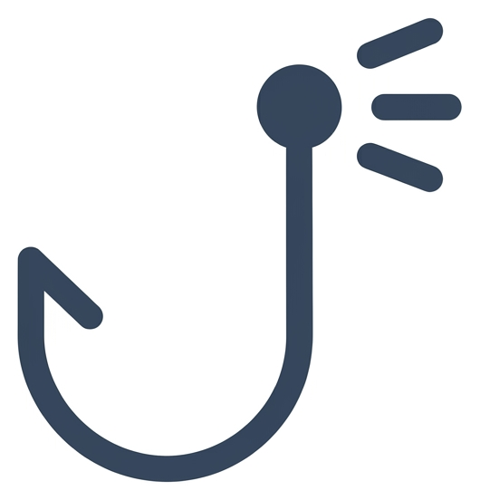
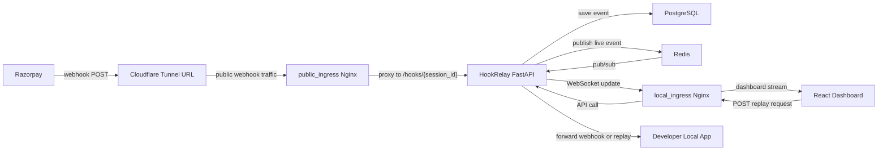
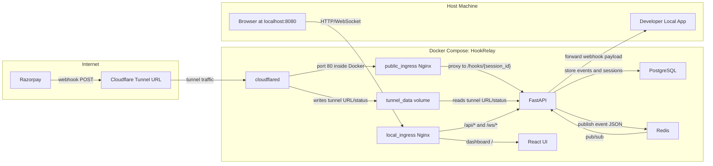
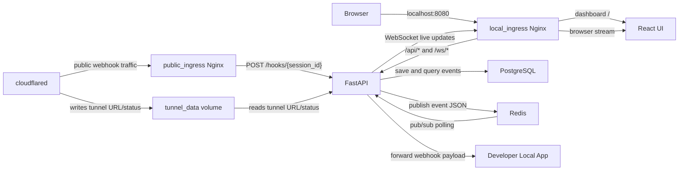

<p align="center">
  
</p>

<h1 align="center">HookRelay</h1>

<p align="center">
  <strong>Catch webhooks. Inspect them. Forward to your local app. Replay on demand.</strong><br>
  Payload history is stored in your local PostgreSQL volume.
</p>

<p align="center">
  
  
  
  
  
  
</p>

---

HookRelay is a local webhook debugger for Razorpay development. It receives webhooks through a public tunnel or local ingress, shows them in a real-time dashboard, forwards them to your dev server, and records replayable event history.

## What It Does

- Receives Razorpay webhooks at a session-specific endpoint.
- Stores headers, body, query parameters, delivery status, and forwarding errors.
- Shows events in a local React dashboard with WebSocket updates.
- Forwards payloads to a local handler such as `http://host.docker.internal:3000/api/webhooks/razorpay`.
- Replays stored events and records each replay as a new event.
- Generates Razorpay fixture payloads for local testing.

## Stack

- Backend: FastAPI, SQLAlchemy, PostgreSQL, Redis
- Frontend: React, Vite
- Runtime: Docker Compose
- Ingress: Cloudflare Tunnel, Nginx
- Tests: Python `unittest`, npm lint and build

## Quick Start

```bash
git clone https://github.com/vishal24p/hookrelay.git
cd hookrelay
cp .env.example .env
docker compose up --build
```

Open the dashboard:

```text
http://localhost:8080
```

If port `8080` is already in use, set `HOOKRELAY_HTTP_PORT` in `.env` and restart Docker Compose.

## Architecture

### Webhook Debugging Flow



### Outside Docker to Inside Docker



### Internal Container Data Flow



## Dashboard Use

1. Open `http://localhost:8080`.
2. Create or select an endpoint.
3. Set provider to `razorpay`.
4. Add a Razorpay webhook secret if you want signature-aware local tests.
5. Set the forward URL to your local handler.
6. Send a Razorpay test webhook to the endpoint URL shown in the dashboard.
7. Inspect, replay, clear, or download stored events.

Use `host.docker.internal` when forwarding to an app running on your host machine. `localhost` from inside the backend container points back to the container.

## API Examples

Receive a webhook through the local dashboard ingress:

```bash
curl -X POST http://localhost:8080/api/hooks/razorpay-dev \
  -H "Content-Type: application/json" \
  -d '{"event":"payment.captured","payload":{"payment":{"entity":{"id":"pay_test","order_id":"order_test"}}}}'
```

Configure forwarding for a session:

```bash
curl -X PUT http://localhost:8080/api/sessions/razorpay-dev/config \
  -H "Content-Type: application/json" \
  -d '{
    "provider": "razorpay",
    "forward_url": "http://host.docker.internal:3000/api/webhooks/razorpay"
  }'
```

Replay a stored event:

```bash
curl -X POST http://localhost:8080/api/hooks/razorpay-dev/42/replay
```

## Configuration

Copy `.env.example` to `.env` before running Docker Compose.

Important settings:

- `POSTGRES_USER`, `POSTGRES_PASSWORD`, `POSTGRES_DB`: local database credentials.
- `HOOKRELAY_HTTP_PORT`: host port for the local dashboard, default `8080`.
- `CORS_ALLOW_ORIGINS`: browser origins allowed to call the local control API.
- `MAX_WEBHOOK_BODY_BYTES`: maximum webhook body size.
- `CLOUDFLARE_TUNNEL_TOKEN`: optional named Cloudflare tunnel token.
- `TUNNEL_HOSTNAME`: optional public hostname for a named tunnel.

Keep real webhook secrets in `.env`; do not commit them.

## Development

Backend tests:

```bash
python -m pip install -r backend/requirements.txt
python -m unittest discover -s backend/tests -p "test_*.py"
```

Frontend checks:

```bash
cd frontend
npm ci
npm run lint
npm run build
```

Full project check:

```bash
make check
```

## Troubleshooting

- Dashboard does not open: check Docker Compose logs and confirm `HOOKRELAY_HTTP_PORT` is free.
- Local app does not receive events: use `host.docker.internal` or a LAN IP in the forward URL, not `localhost`.
- Public webhook URL is missing: check the `tunnel` container logs and the `/api/tunnel-url` response.
- WebSocket updates do not appear: confirm `local_ingress` is routing `/ws/*` and Redis is healthy.

## Privacy

Webhook payloads are stored in the local PostgreSQL Docker volume. Payloads still cross any public tunnel you configure before reaching your machine. Use test-mode payment data and avoid sending production secrets to local development tools.

## CI

GitHub Actions runs backend tests, frontend lint, frontend build, license checks, and Docker Compose config validation.

## License

MIT License. See [LICENSE](LICENSE).
