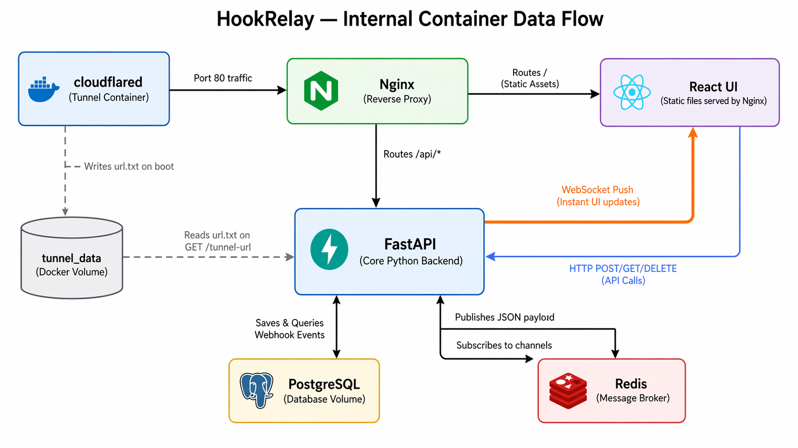

# HookRelay

> Catch webhooks. Inspect them. Forward to your local app. Replay on demand. **All data stays on your machine.**

[](LICENSE)
[](docker-compose.yml)
[](backend/requirements.txt)
[](docker-compose.yml)

HookRelay is a self-hosted developer tool that acts as a **middleman between external services and your local application**. It receives webhooks from Stripe, Razorpay, GitHub, or any HTTP service, displays them in a real-time dashboard, and forwards them directly to your running app — with zero config.

Unlike cloud-hosted alternatives (Webhook.site, RequestBin, Hookdeck), HookRelay runs entirely on your machine inside Docker. **No payload data is ever stored on a third-party server.** This makes it the only free option suitable for developers working with sensitive payment data, health records, or NDA-protected client projects.

---

## Why This Exists

Every developer building payment integrations hits the same wall:

1. Razorpay/Stripe needs a **public HTTPS URL** to send webhooks to.
2. Your app is running on `localhost:3000` — invisible to the internet.
3. You use ngrok or Webhook.site, but your **payment payload is now sitting on someone else's server**.
4. The tunnel URL **changes every time you restart**, so you keep updating Razorpay's dashboard.

HookRelay solves all four problems:

```
Razorpay → https://hooks.yourdomain.com/api/hooks/razorpay
                        ↓  (captured + displayed in real-time)
                   HookRelay Dashboard (localhost)
                        ↓  (forwarded instantly to your app)
          http://localhost:3000/api/webhooks/razorpay
                        ↓  (response recorded)
                   ✅ 200 OK  or  ❌ 500 Error
```

---

## Features

| Feature | Description |
|---|---|
| 🌐 **Auto Tunnel** | Cloudflare tunnel starts automatically — no account, no config, no signup |
| 🔒 **Permanent URL** | Optional named tunnel so your webhook URL never changes again (~$9/year for a domain) |
| 📡 **Real-time Dashboard** | WebSocket-powered live feed — events appear instantly without refresh |
| 🔀 **Forwarding** | Per-session forwarding URL sends every webhook to your local app automatically |
| ↻ **Replay** | Re-send any stored event to your app with one click — no new payment triggered |
| ↓ **Download JSON** | Export any payload as a `.json` file for use in unit tests or mock data |
| 🟢 **Status Badges** | Green / Yellow / Red badges showing your app's response code for each forwarded event |
| 🗂️ **Sessions** | Isolated channels per service — `stripe`, `razorpay`, `github`, etc. |
| 🏠 **100% Local** | All data stored in your local PostgreSQL — zero bytes leave your machine |

---

## Architecture

### High-Level Data Flow

This diagram shows how an external webhook travels from the internet, through the Docker environment, and into your locally running application.


**The flow in plain English:**
1. Razorpay fires an HTTPS POST to your public tunnel URL.
2. The `cloudflared` container receives it and passes it to Nginx.
3. Nginx routes `/api/*` requests to FastAPI.
4. FastAPI saves the event to PostgreSQL and publishes it to Redis.
5. FastAPI pushes the event to your browser via WebSocket (instant dashboard update).
6. FastAPI forwards the original payload to your local app via `host.docker.internal`.
7. Your app's response (200 OK / 500 Error) is recorded back in the database.

### Internal Container Data Flow

This diagram zooms into the Docker environment and shows how the six containers communicate internally.



---

## Tech Stack

| Layer | Technology | Purpose |
|---|---|---|
| **Backend** | FastAPI + SQLAlchemy | API server, webhook receiver, forwarding engine, WebSocket hub |
| **Database** | PostgreSQL 15 | Persistent storage for events and session configs |
| **Message Broker** | Redis 7 | Pub/Sub channel for real-time event broadcasting |
| **Frontend** | React + Vite | Live dashboard UI |
| **Proxy** | Nginx | Routes traffic between frontend, API, and WebSocket connections |
| **Tunnel** | Cloudflare `cloudflared` | Exposes your local HookRelay to the public internet over HTTPS |
| **Runtime** | Docker Compose | Orchestrates all six containers with one command |

---

## Prerequisites

Before you start, make sure you have:

- [Docker Desktop](https://www.docker.com/products/docker-desktop/) installed and running (Windows, macOS, or Linux)
- [Git](https://git-scm.com/downloads) installed
- ~500 MB of free disk space for Docker images

That's it. No Python, no Node.js, no Redis — Docker handles everything.

---

## Quick Start (Zero Config)

Get HookRelay running in under 2 minutes:

```bash
# 1. Clone the repository
git clone https://github.com/YOUR_USERNAME/hookrelay.git
cd hookrelay

# 2. Start everything
docker compose up --build
```

Wait for all containers to start (~30-60 seconds on first build). You'll see output like:

```
api-1       | INFO:     Uvicorn running on http://0.0.0.0:8000
tunnel-1    | ==> Quick tunnel mode: temporary URL
tunnel-1    | ==> Tunnel URL written: https://random-words.trycloudflare.com
```

**3. Open your dashboard:** Navigate to [http://localhost](http://localhost) in your browser.

The blue banner at the top displays your public tunnel URL. Copy it and paste it into any webhook provider (Razorpay, Stripe, GitHub, etc.).

---

## Step-by-Step Setup Guide

### Step 1: Create a Session

In the dashboard sidebar, type a descriptive session name (e.g., `razorpay`) in the input box and press **Enter**. Sessions are isolated channels — you can create separate ones for each service.

### Step 2: Copy Your Public Webhook URL

Copy the URL from the blue **🌐 PUBLIC** banner at the top of the dashboard:

```
https://xxxx-yyyy.trycloudflare.com/api/hooks/razorpay
```

Go to your external service (e.g., Razorpay Dashboard → Settings → Webhooks) and paste this URL as your webhook endpoint.

### Step 3: Set a Forwarding URL

In the **FWD →** input row on the dashboard, type your local application's webhook endpoint:

```
http://host.docker.internal:3000/api/webhooks/razorpay
```

Click **Save**.

> **What is `host.docker.internal`?**
> This is Docker's built-in DNS name that resolves to your host machine's IP address. It allows containers to reach services running outside Docker. Replace `3000` with whatever port your application is running on.

### Step 4: Trigger a Webhook

Make a test payment or use the **Send test webhook** button in the dashboard. You'll see:

1. The event appear instantly in the dashboard (real-time via WebSocket).
2. A green **→ 200 OK** badge if your app responded successfully.
3. A red **→ Error** badge if your app is down or returned an error.

### Step 5: Replay Events

Click **↻ Replay** on any event card to re-send the exact same payload to your app. This is useful for:

- Debugging a webhook handler without triggering a real payment
- Testing error recovery logic
- Reproducing edge cases

> **Note:** Replay creates a new event record marked as `REPLAY` so you can distinguish it from the original.

### Step 6: Download Payloads

Click **↓ JSON** on any event to download the raw payload as a `.json` file. Use these files to:

- Build mock data for unit tests
- Share exact payloads with teammates
- Document webhook formats

---

## Permanent URL Setup (Recommended)

By default, HookRelay uses Cloudflare's free "quick tunnel" which generates a random URL like `https://random-words.trycloudflare.com`. **This URL changes every time you restart Docker.**

To get a **permanent URL that never changes**, follow these steps:

### What You Need

| Item | Cost |
|---|---|
| Cloudflare account | Free |
| Domain name (.com) | ~$9/year |
| Named tunnel | Free |

### Setup Steps

**1. Create a free Cloudflare account** at [cloudflare.com](https://cloudflare.com).

**2. Add your domain to Cloudflare.** If you already own a domain, change its nameservers to Cloudflare's (shown in the dashboard). If you don't own one, you can buy one directly through Cloudflare Registrar for ~$9/year.

**3. Create a tunnel.** Go to [Cloudflare Zero Trust Dashboard](https://one.cloudflare.com) → Networks → Tunnels → **Create a tunnel**.

**4. Name it** `hookrelay` and copy the tunnel token shown on screen.

**5. Add a public hostname.** In the tunnel configuration:
   - **Subdomain:** `hooks`
   - **Domain:** `yourdomain.com`
   - **Service:** `http://nginx:80`

**6. Create a `.env` file** in your HookRelay project root:

```bash
cp .env.example .env
```

Then edit `.env` and fill in your values:

```env
CLOUDFLARE_TUNNEL_TOKEN=eyJhIjoiNjk2ZDg5...your_token_here
TUNNEL_HOSTNAME=hooks.yourdomain.com
```

**7. Restart HookRelay:**

```bash
docker compose down
docker compose up --build
```

Your permanent URL is now live:

```
https://hooks.yourdomain.com/api/hooks/razorpay
```

Set this in Razorpay/Stripe **once** — it will never change again, even after restarts.

### How Dual-Mode Tunnel Works

HookRelay automatically detects which mode to use:

```
.env file has CLOUDFLARE_TUNNEL_TOKEN set?
    │
    ├── YES → Named tunnel mode (permanent URL)
    │         URL: https://hooks.yourdomain.com
    │
    └── NO  → Quick tunnel mode (temporary URL, zero config)
              URL: https://random-words.trycloudflare.com
```

The tunnel startup script (`tunnel/start.sh`) handles this automatically.

---

## Project Structure

```
hookrelay/
├── backend/
│   ├── app/
│   │   ├── main.py            # FastAPI app — endpoints, WebSocket, forwarding engine
│   │   ├── models.py          # SQLAlchemy models (WebhookEvent, SessionConfig)
│   │   ├── schemas.py         # Pydantic request/response schemas
│   │   └── database.py        # Database connection and session factory
│   ├── Dockerfile
│   └── requirements.txt       # Python dependencies (FastAPI, SQLAlchemy, Redis, httpx)
│
├── frontend/
│   ├── src/
│   │   └── App.jsx            # Complete React dashboard UI
│   ├── index.html
│   ├── package.json
│   └── Dockerfile
│
├── nginx/
│   └── nginx.conf             # Routes: /api/* → FastAPI, /ws/* → WebSocket, / → React
│
├── tunnel/
│   ├── Dockerfile             # Alpine + cloudflared binary (multi-stage build)
│   └── start.sh               # Dual-mode: named tunnel or quick tunnel
│
├── docs/
│   └── EXTERNAL-SERVICES.md   # Detailed guide for connecting Razorpay, Stripe, GitHub
│
├── docker-compose.yml         # Orchestrates all 6 containers
├── .env.example               # Template for permanent tunnel configuration
├── .gitignore
└── README.md
```

---

## API Reference

All endpoints are served under the `/api/` prefix by Nginx.

### Webhook Endpoints

| Method | Endpoint | Description |
|---|---|---|
| `POST` | `/api/hooks/{session_id}` | Receive a webhook payload. Saves to DB, publishes to Redis, optionally forwards. |
| `GET` | `/api/hooks/{session_id}` | List all stored events for a session (newest first). |
| `DELETE` | `/api/hooks/{session_id}` | Clear all events for a session. |
| `POST` | `/api/hooks/{session_id}/{event_id}/replay` | Replay a stored event — re-forwards the original payload to your app. |

### Session Endpoints

| Method | Endpoint | Description |
|---|---|---|
| `GET` | `/api/sessions` | List all active session IDs ordered by most recent activity. |
| `GET` | `/api/sessions/{session_id}/config` | Get the forwarding URL for a session. |
| `PUT` | `/api/sessions/{session_id}/config` | Save or update the forwarding URL for a session. |

### System Endpoints

| Method | Endpoint | Description |
|---|---|---|
| `GET` | `/api/tunnel-url` | Returns the current Cloudflare tunnel URL (read from shared Docker volume). |
| `GET` | `/api/health` | Health check — returns `{"status": "ok"}`. |
| `WS` | `/ws/{session_id}` | Real-time WebSocket stream. Events are pushed instantly as JSON. |

### Example: Receive a Webhook via cURL

```bash
curl -X POST https://your-tunnel-url.trycloudflare.com/api/hooks/razorpay \
  -H "Content-Type: application/json" \
  -d '{"event": "payment.captured", "order_id": "order_abc123", "amount": 5000}'
```

### Example: Set a Forwarding URL

```bash
curl -X PUT http://localhost/api/sessions/razorpay/config \
  -H "Content-Type: application/json" \
  -d '{"forward_url": "http://host.docker.internal:3000/api/webhooks/razorpay"}'
```

### Example: Replay an Event

```bash
curl -X POST http://localhost/api/hooks/razorpay/42/replay
```

---

## Database Schema

HookRelay stores all data in a local PostgreSQL database. Nothing is ever sent to the cloud.

### Table: `webhook_events`

| Column | Type | Description |
|---|---|---|
| `id` | Integer (PK) | Auto-incrementing event ID |
| `session_id` | String(100) | Session this event belongs to (e.g., `razorpay`) |
| `method` | String(10) | HTTP method (`POST`, `GET`, or `REPLAY`) |
| `headers` | JSON | Complete request headers as key-value pairs |
| `body` | Text | Raw request body (usually JSON) |
| `query_params` | JSON | URL query parameters |
| `received_at` | DateTime | Timestamp when the webhook was received |
| `forward_status` | Integer | HTTP status code returned by your app (e.g., `200`, `500`) |
| `forward_response` | Text | First 2000 chars of your app's response body |
| `forward_error` | Text | Error message if forwarding failed (e.g., connection refused) |
| `forwarded_at` | DateTime | Timestamp when the webhook was forwarded |

### Table: `session_configs`

| Column | Type | Description |
|---|---|---|
| `session_id` | String(100) (PK) | Session identifier |
| `forward_url` | Text | URL to forward webhooks to (e.g., `http://host.docker.internal:3000/...`) |
| `created_at` | DateTime | When this config was first created |
| `updated_at` | DateTime | When this config was last modified |

---

## How Forwarding Works

When a webhook arrives at `/api/hooks/{session_id}`, FastAPI checks if a forwarding URL is configured for that session. If one exists, it immediately `POST`s the original payload to your app using Python's `httpx` library.

```python
# Simplified version of what happens inside main.py
async with httpx.AsyncClient(timeout=10.0) as client:
    response = await client.post(
        forward_url,                              # Your app's endpoint
        content=original_raw_body,                # Exact same bytes
        headers={"Content-Type": content_type},   # Preserves content type
    )
```

The forwarding result (status code, response body, or error message) is saved back to the database so you can see it in the dashboard.

### Why `host.docker.internal`?

HookRelay runs inside Docker. Your application runs outside Docker on your host machine. Docker provides a special DNS name — `host.docker.internal` — that resolves to your host machine's IP address.

```
┌─────────────────────────────┐
│  Docker Network             │
│                             │
│  FastAPI ──httpx.post()──►──┼──► host.docker.internal:3000
│                             │         │
└─────────────────────────────┘         │
                                        ▼
                               Your app on localhost:3000
```

This means you can forward to any port on your machine: `3000`, `8080`, `4200`, etc.

---

## How Real-Time Updates Work

HookRelay uses a **Redis Pub/Sub + WebSocket** pipeline to deliver instant updates to your browser:

1. **Webhook arrives** → FastAPI saves it to PostgreSQL.
2. **FastAPI publishes** the event JSON to Redis channel `webhook:{session_id}`.
3. **FastAPI's WebSocket handler** subscribes to that Redis channel.
4. **Redis pushes** the message to the WebSocket handler.
5. **WebSocket sends** the JSON to your browser instantly.

This means the dashboard updates the moment a webhook arrives — no polling, no refresh needed.

---

## Troubleshooting

### "I can't see the tunnel URL in the dashboard"

The tunnel container might still be starting. Wait 15-30 seconds and refresh. Check tunnel logs:

```bash
docker compose logs tunnel
```

### "Forwarding says 'connection refused'"

Your local app isn't running, or it's on a different port. Make sure:

1. Your app is running (`npm run dev`, `python manage.py runserver`, etc.)
2. The port in the forwarding URL matches your app's port
3. You're using `host.docker.internal` (not `localhost`)

```
✅ http://host.docker.internal:3000/api/webhooks
❌ http://localhost:3000/api/webhooks        ← won't work from inside Docker
```

### "Events appear in the dashboard but not in my app"

Check that you've saved a forwarding URL. Look for the green **✓ Saved** confirmation after clicking Save in the **FWD →** row.

### "The tunnel URL changed after restart"

This is expected with the free quick tunnel. To get a permanent URL, follow the [Permanent URL Setup](#permanent-url-setup-recommended) section above (~$9/year for a domain).

### "Docker build is slow"

First build downloads all base images (~500 MB). Subsequent builds use Docker's cache and are much faster. If you want to rebuild from scratch:

```bash
docker compose down -v
docker compose up --build
```

### "Port 80 is already in use"

Another service (like IIS, Apache, or another Docker container) is using port 80. Either stop that service or change the Nginx port in `docker-compose.yml`:

```yaml
nginx:
  ports:
    - "8080:80"  # Use port 8080 instead
```

Then access the dashboard at `http://localhost:8080`.

---

## Data Privacy

HookRelay is designed with a **zero-cloud-storage** principle:

| Component | Where data lives | Who can access it |
|---|---|---|
| Webhook payloads | Your local PostgreSQL volume | Only you |
| Session configs | Your local PostgreSQL volume | Only you |
| Tunnel URL | Docker shared volume (RAM) | Only your containers |
| Dashboard state | Your browser memory | Only you |

**What passes through Cloudflare:** The webhook payload transits through Cloudflare's network (encrypted via HTTPS/WireGuard) on its way to your machine. Cloudflare's [privacy policy](https://www.cloudflare.com/privacypolicy/) states they do not log request content. For maximum privacy, use [frp on your own VPS](https://github.com/fatedier/frp) instead of Cloudflare.

---

## Stopping and Cleaning Up

```bash
# Stop all containers (data is preserved)
docker compose down

# Stop and DELETE all data (events, configs, everything)
docker compose down -v

# Rebuild after code changes
docker compose up --build
```

---

## Contributing

Contributions are welcome. To get started:

```bash
git clone https://github.com/YOUR_USERNAME/hookrelay.git
cd hookrelay
docker compose up --build
```

The backend auto-reloads on code changes (mounted volume). The frontend hot-reloads via Vite.

---

## License

This project is licensed under the [MIT License](LICENSE).

Copyright (c) 2026 HookRelay Contributors
