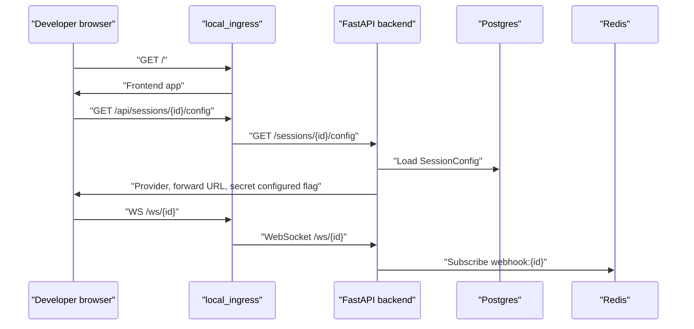
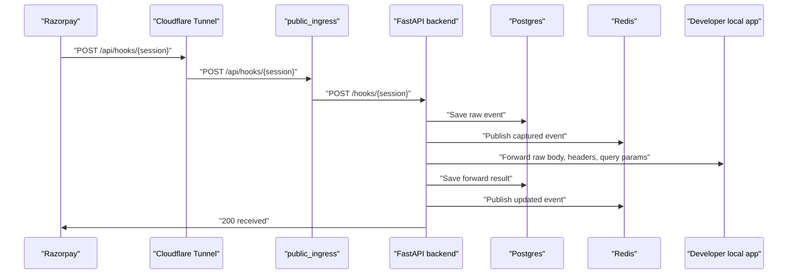
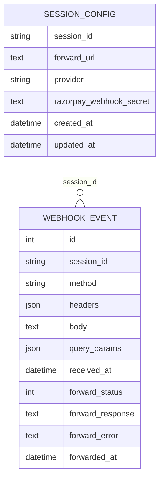

# HookRelay Current Architecture

## Purpose

HookRelay is a local developer tool for testing Razorpay webhooks before wiring a real Razorpay dashboard endpoint.

It gives the developer:

- A local control UI.
- A public webhook URL through Cloudflare Tunnel.
- A backend that captures webhook requests.
- Razorpay-specific signature, metadata, duplicate, fixture, forward, and replay diagnostics.
- A way to forward captured events into the developer's local app.

## Current Runtime Architecture

```mermaid
flowchart LR
  "Developer Browser" -->|"http://127.0.0.1"| "local_ingress nginx"
  "local_ingress nginx" -->|"UI"| "frontend Vite"
  "local_ingress nginx" -->|"/api/*"| "FastAPI backend"
  "local_ingress nginx" -->|"/ws/*"| "FastAPI WebSocket"

  "Razorpay or fixture sender" -->|"public URL"| "Cloudflare Tunnel"
  "Cloudflare Tunnel" -->|"http://public_ingress:80"| "public_ingress nginx"
  "public_ingress nginx" -->|"/api/hooks/{session}"| "FastAPI backend"

  "FastAPI backend" -->|"SQLAlchemy"| "Postgres"
  "FastAPI backend" -->|"pub/sub"| "Redis"
  "FastAPI backend" -->|"optional POST"| "Developer local app"
  "Cloudflare Tunnel" -->|"writes tunnel_url.txt"| "shared tunnel volume"
  "FastAPI backend" -->|"reads tunnel_url.txt"| "shared tunnel volume"
```

## Request Flow

### Local Control Flow



### Public Webhook Flow



## Backend Modules

### `backend/app/main.py`

Current role:

- Owns FastAPI app setup.
- Owns both local control routes and public ingress routes.
- Owns session config CRUD.
- Owns webhook capture.
- Owns forwarding.
- Owns replay.
- Owns WebSocket subscription.
- Owns tunnel URL read.
- Owns Razorpay signature verification wrapper.
- Owns serialization.

Technical issue:

- It is doing too much. The file is acting as router, service layer, serializer, config service, and delivery engine.

Real-world example:

- If a mechanic keeps diagnostics, parts inventory, repair work, billing, and customer phone calls in one notebook, the notebook works for one customer. It fails when a second mechanic needs to help. `main.py` is currently that notebook.

### `backend/app/models.py`

Current role:

- `WebhookEvent`: stored raw request, forward result, timestamps.
- `SessionConfig`: forward URL, provider, Razorpay secret.

Technical issue:

- The database stores enough data for the current tool.
- Secrets are stored as plain text because local forwarding and fixture signing need the secret. For a local-only OSS tool this can be acceptable, but it must remain clear that this is local dev data.

### `backend/app/schemas.py`

Current role:

- API response/request contracts for events, session config, and fixture request generation.

Technical issue:

- Event response is growing because it now contains raw request data, forwarding diagnostics, Razorpay metadata, duplicate status, fixture status, and replay signals.
- This is useful but should be grouped conceptually in code over time.

### Razorpay Helper Modules

Current modules:

- `razorpay_metadata.py`
- `razorpay_duplicates.py`
- `razorpay_fixtures.py`
- `forwarding_diagnostics.py`

Current role:

- These keep important provider-specific and diagnostics logic out of `main.py`.

Keep:

- These are good boundaries. They are small, testable, and have focused unit tests.

Improve later:

- Move signature verification out of `main.py` into a Razorpay diagnostics module.
- Move event serialization out of `main.py` after the public ingress bug is fixed.

## Frontend Modules

### `frontend/src/App.jsx`

Current role:

- Owns global API base configuration.
- Owns tunnel polling.
- Owns session config load/save.
- Owns copy actions.
- Owns layout and nearly all CSS.
- Coordinates endpoint, setup, event list, inspector, banners, and dialog state.

Technical issue:

- It is too large for safe redesign work. CSS, layout, API orchestration, and feature behavior are mixed.

Real-world example:

- A restaurant kitchen cannot run well if the menu, recipes, order queue, billing, and table layout are all written on one board. Any change to seating can accidentally change the recipe. That is the current redesign risk in `App.jsx`.

### `frontend/src/hooks/useEndpointState.jsx`

Current role:

- Tracks current endpoint id from URL hash.
- Tracks local endpoint labels/history in localStorage.
- Loads backend sessions and summaries.

Keep:

- This is a good state boundary.

Concern:

- It mixes local drafts and persisted backend sessions. That is usable now, but the UI should make the distinction simpler.

### `frontend/src/hooks/useEventStream.jsx`

Current role:

- Loads event history.
- Opens WebSocket.
- Sends fixture/test payloads.
- Clears events.
- Replays events.

Keep:

- This is the right home for event stream behavior.

Concern:

- It currently knows provider-specific fixture logic. For Razorpay-first this is acceptable, but it should not grow into a generic provider framework yet.

### Components

Current components:

- `EndpointSidebar`: endpoint navigation and creation.
- `SetupRail`: public URL, provider, forward target, fixture send.
- `EventList`: event feed.
- `EventInspector`: event details, body, forward, metadata, replay/download.
- `StatusBanner`: error/status display.
- `ConfirmDialog`: deletion/clear confirmation.

Keep:

- These component boundaries are generally correct.

Replace later:

- The visual layout should move toward event-first workbench structure.
- Setup should become a compact command area, not the visual center once an event exists.

## Current Public Ingress Bug

The E2E report found:

```text
no resolver defined to resolve api
```

Location:

```text
nginx/public.conf
```

Why it happens:

- The regex location captures `{session_id}` and uses it inside `proxy_pass`.
- In nginx, `proxy_pass` with variables causes DNS resolution at request time.
- Docker service names such as `api` need Docker DNS resolver `127.0.0.11`.
- `public.conf` does not define that resolver.

Technical fix direction:

```nginx
resolver 127.0.0.11 valid=30s ipv6=off;
```

Then retest public webhook POST through Cloudflare.

## Data Model



Note:

- This relation is logical. The current model does not define a database foreign key.

## Current Test Architecture

Existing tests cover helper logic:

- Forwarding diagnostics.
- Replay payload construction.
- Razorpay duplicate matching.
- Razorpay fixture shape and signature generation.
- Razorpay metadata extraction.

Missing tests:

- API route tests for capture/config/replay.
- Public ingress test for tunnel-facing path.
- Frontend component or browser tests.

## High-Level Cleanup Direction

Clean in this order:

1. Fix public ingress.
2. Add API smoke tests around the fixed path.
3. Split backend route logic out of `main.py` only where it reduces real risk.
4. Split frontend CSS/layout from `App.jsx` before the new UI implementation.
5. Redesign from the event-first workbench direction.

Do not start with a large refactor. The product still needs the public URL path to work first.
